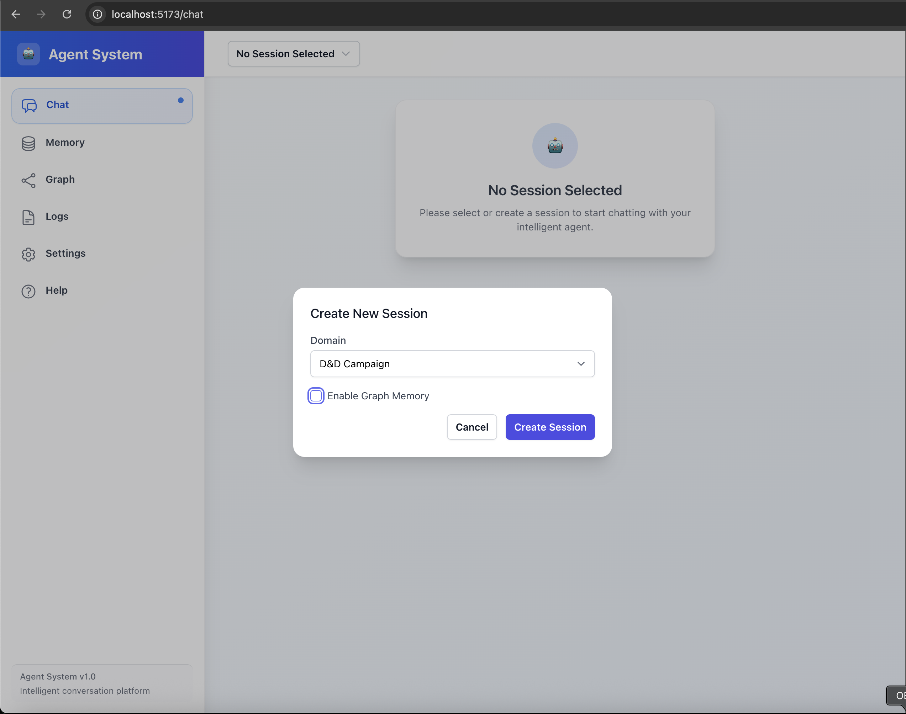
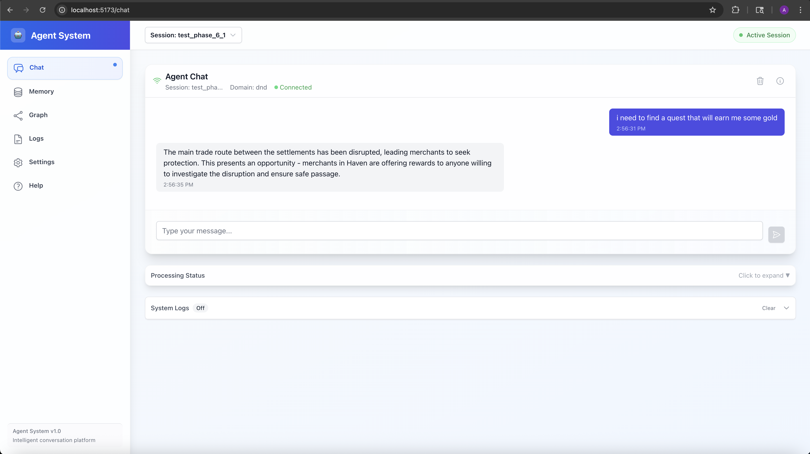
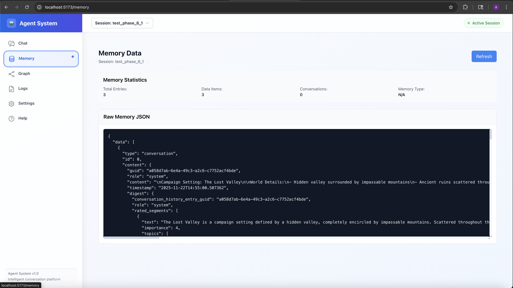
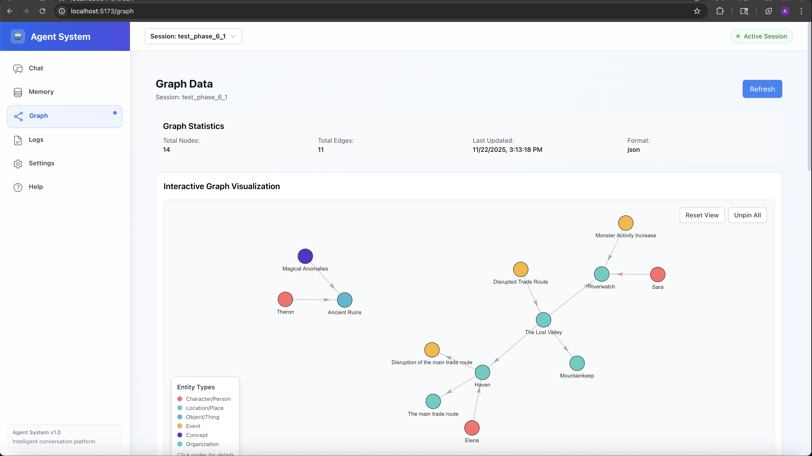
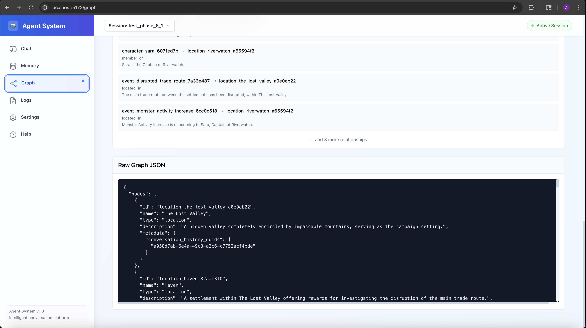
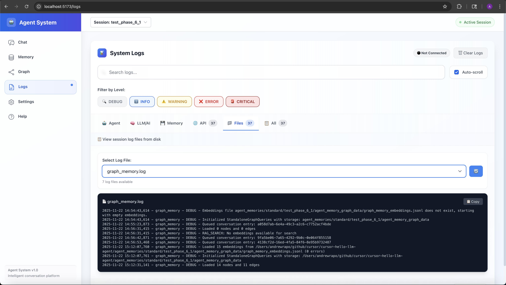

# LLM-Driven Agent with RAG-Enabled Session Memory

This project is a modern, extensible framework for building domain-agnostic LLM-powered agents with persistent, semantically searchable memory. The system supports Retrieval Augmented Generation (RAG), segment-level embeddings, robust memory compression, and knowledge graph construction, making it suitable for complex, long-running conversational applications.

Important: This project has been "vibe-coded" using Cursor as a way to get familiar with agent-assisted development. All of the agent interactions have been preserved in `/cursor-notes` (initially) and now going forward in `/.specstory` as markdown transcripts.

This README contains a description of the current state of the project. For historical details, see:
- cursor-notes (contains the original cursor instructions and .specstory files)
- [README-phase-2.md](README-phase-2.md) (phase 2 development notes)
- [README-phase-3.md](README-phase-3.md) (phase 3 development notes)
- [README-phase-4.md](README-phase-4.md) (phase 4 development notes)
- [README-phase-5.md](README-phase-5.md) (phase 5 development notes)
- [README-phase-6.md](README-phase-6.md) (phase 6 development notes - current phase)

---

## Project Highlights

- **RAG-Enabled Memory**: Memory is searchable using segment-level embeddings and semantic similarity (RAG). Relevant context is automatically retrieved and injected into LLM prompts for grounded, context-aware responses.
- **Knowledge Graph Memory**: Automatic entity and relationship extraction builds structured knowledge graphs that enhance context retrieval and reasoning.
- **Turn-Based, Importance-Filtered Compression**: Conversation history is compressed in user+agent turns, retaining only the most important segments (rated by the LLM) for efficient, scalable memory.
- **Provider-Agnostic LLM Service**: Supports both local (Ollama) and cloud (OpenAI) LLMs, with per-call options for temperature, streaming, and embedding generation.
- **Standardized Logging**: Session-scoped logging with `LoggingConfig` for organized, traceable operations.
- **Modular, Domain-Agnostic Agent**: The agent is phase-driven (INITIALIZATION, LEARNING, INTERACTION) and can be configured for any domain via external config files—no code changes required.
- **Robust, Modern Test Suite**: Comprehensive tests for memory, agent, embeddings, RAG, and segmentation. Includes automated testing framework with LLM-driven user simulators.
- **Extensible and Maintainable**: All major components (memory, embeddings, RAG, agent, graph memory) are modular and easily extended or replaced.

---

## Core Architecture

### 1. Memory Management System

- **BaseMemoryManager**: Abstract base class for all memory managers (handles persistence, interface, and GUIDs).
- **MemoryManager**: Main implementation. Features:
  - **Static Memory**: Foundational, read-only knowledge (seeded at initialization).
  - **Context**: Compressed, topic-organized, high-importance information from past conversations.
  - **Conversation History**: Full record of all interactions, with each entry digested into LLM-rated segments (importance, topics, type).
  - **Segment-Level Embeddings**: Only the most meaningful segments are embedded and indexed for semantic search.
  - **Automatic, Turn-Based Compression**: After a configurable number of turns, memory is compressed to retain only important segments, preserving dialogue flow and traceability.
  - **Graph Memory Integration**: Background processing of conversation segments to build knowledge graphs.
- **SimpleMemoryManager**: Flat, non-transforming memory for testing and simple use cases.

### 2. Embeddings and RAG Layer

- **EmbeddingsManager**: Handles all embedding generation, storage (JSONL), and semantic search. Embeddings are generated for each LLM-rated segment, not just full entries.
- **RAGManager**: Retrieves semantically relevant context for queries using the EmbeddingsManager. Injects this context into LLM prompts for Retrieval Augmented Generation (RAG).
- **Canonical Example**: See `examples/rag_enhanced_memory_example_simple.py` for a minimal, end-to-end RAG workflow.

### 3. Graph Memory System

- **GraphManager**: Manages knowledge graph construction, entity resolution, and graph queries. Processes conversation segments in the background to extract structured knowledge.
- **EntityExtractor**: LLM-driven extraction of domain-specific entities (characters, locations, objects, events, concepts, organizations).
- **RelationshipExtractor**: Automatic discovery of relationships between entities (spatial, ownership, social, causal, temporal).
- **EntityResolver**: RAG-based similarity matching prevents duplicate entities using configurable thresholds.
- **GraphQueries**: Structured queries for entity context, relationship traversal, and semantic search integration.
- **Background Processing**: Standalone graph processing system for non-blocking knowledge graph updates.

### 4. LLM Service Layer

- **Provider-Agnostic**: Supports Ollama (local) and OpenAI (cloud) via a common interface.
- **Configurable**: Per-call options for temperature, streaming, and embedding model.
- **Standardized Logging**: Uses `LoggingConfig` for session-scoped, organized logging.

### 5. Agent Layer

- **Phase-Driven**: The agent manages conversation flow through INITIALIZATION, LEARNING, and INTERACTION phases.
- **Delegation**: All memory operations (creation, update, compression, retrieval) are handled by the memory manager. The agent is domain-agnostic and stateless regarding memory.
- **Domain Configuration**: Behavior is controlled via external config files (see `examples/domain_configs.py`).

### 6. Logging System

- **LoggingConfig**: Centralized logging configuration providing session-scoped loggers.
- **Component-Specific Loggers**: Separate loggers for different components (agent, memory_manager, ollama_general, ollama_digest, ollama_embeddings, etc.).
- **Organized Storage**: Logs organized by session GUID in structured directories.

---

## Key Features

- **RAG-Enhanced Memory Search**: Retrieve contextually relevant information from any point in conversation history using semantic similarity.
- **Knowledge Graph Construction**: Automatic extraction of entities and relationships builds structured knowledge graphs.
- **Segment-Only Embeddings**: Only the most important, LLM-rated segments are embedded and indexed, improving retrieval quality and efficiency.
- **Automatic, Turn-Based Memory Compression**: Keeps memory size manageable while preserving important context and dialogue flow.
- **Background Graph Processing**: Non-blocking knowledge graph updates via standalone processing system.
- **Separation of Concerns**: Agent, memory, embeddings, RAG, and graph memory are fully decoupled and independently testable.
- **Persistent, Traceable Storage**: All memory and conversation history is saved to disk with GUIDs for traceability.
- **Robust Error Handling**: Defensive programming throughout, with automatic backups and recovery.
- **Modern Test Suite**: Tests for all major components, including integration with real LLM endpoints and automated testing with user simulators.

---

## Example Use Cases

- **D&D Campaign Management**: Create and manage a virtual campaign world, with persistent memory, semantic search, and knowledge graph tracking of characters, locations, and relationships.
- **User Story Generation**: Assist in requirements gathering and feature planning for software projects.
- **RAG-Enhanced Q&A**: Retrieve and use relevant historical context for any domain.
- **Basic Memory Operations**: Demonstrate direct memory creation, querying, and compression.
- **Knowledge Graph Exploration**: Query structured relationships between entities extracted from conversations.

---

## Setup and Usage

### Prerequisites
- Python 3.8+
- Ollama (for local LLM/embedding models) or OpenAI API key

### Installation
python3 -m venv .venv
source .venv/bin/activate
pip install --upgrade pip setuptools wheel
pip install -e .
pip install -r requirements.txt### Environment Variables

The project uses environment variables for configuration with sensible defaults:

## Ollama Configuration
export OLLAMA_BASE_URL="http://localhost:11434"  # Default: http://localhost:11434
export OLLAMA_MODEL="gemma3"                      # Default: gemma3
export OLLAMA_EMBED_MODEL="mxbai-embed-large"     # Default: mxbai-embed-large

## Optional: Enable debug mode for tests
export DEV_MODE="true"### LLM Service Configuration

Example Ollama setup with standardized logging:

from src.utils.logging_config import LoggingConfig
from src.ai.llm_ollama import OllamaService

## Set up logging for a session
session_guid = "my_session_123"
llm_logger = LoggingConfig.get_component_file_logger(
    session_guid,
    "ollama_general",
    log_to_console=False
)

## Initialize LLM service
llm_service = OllamaService({
    "base_url": os.getenv("OLLAMA_BASE_URL", "http://localhost:11434"),
    "model": os.getenv("OLLAMA_MODEL", "gemma3"),
    "temperature": 0.7,
    "stream": False,
    "logger": llm_logger  # Use LoggingConfig logger
})### Running Examples

## Examples

### Canonical RAG Example (recommended starting point)
OLLAMA_BASE_URL=http://localhost:11434 python examples/rag_enhanced_memory_example_simple.py

### D&D Campaign Example (standard memory manager)
python examples/agent_usage_example.py

### D&D Campaign Example (simple memory manager)
python examples/agent_usage_example.py --type simple

### User Story Generation Example
python examples/user_story_example.py

### Embeddings Manager Example
python examples/embeddings_manager_example.py

### Memory Manager Example
python examples/memory_manager_usage_example.py

### Graph Memory Example
python examples/graph_memory_example.py

### Digest Generator Example
python examples/digest_generator_example.py### Running Testssh

## Tests

### Run all tests
pytest tests/ -v -s

### Run with environment variables
OLLAMA_BASE_URL=http://192.168.10.18:11434 OLLAMA_MODEL=gemma3 OLLAMA_EMBED_MODEL=mxbai-embed-large pytest tests/ -v -s

### Run automated agent tests
python run_automated_tests.py --domain dnd

### Quick test suite
python run_automated_tests.py --quick

### Specific persona testing
python run_automated_tests.py --persona curious_beginner---

## Extensibility & Modularity
- **Add new domains** by providing a new config file—no code changes required.
- **Swap LLM providers** by changing the LLM service instantiation.
- **Extend memory, embeddings, RAG, or graph memory** by subclassing the relevant manager.
- **All components are independently testable and replaceable.**

---

## Further Reading & Development History

## Component Documentation
- [Agent Service](src/agent/README-agent.md): Phase-driven conversational agent design
- [LLM Service](src/ai/README-ai.md): Provider-agnostic LLM interface
- [Memory Manager](src/memory/README-memory-manager.md): RAG-enabled memory system
- [Graph Memory System](src/memory/graph_memory/README-graph-memory.md): Knowledge graph construction and queries

- [README-phase-6.md](README-phase-6.md): Current phase development notes (graph optimization and background processing)
- [README-phase-5.md](README-phase-5.md): Phase 5 development notes
- [README-phase-4.md](README-phase-4.md): Phase 4 development notes
- [README-phase-3.md](README-phase-3.md): Phase 3 development notes
- [README-phase-2.md](README-phase-2.md): Detailed development notes and architectural evolution.
- `cursor-notes/`, `.specstory/`: Historical design and implementation records.

---

## API Server & Web UI

The agent system includes a production-ready API server and modern web interface for browser-based interaction.

### API Server

The FastAPI-based server provides both REST and WebSocket interfaces for agent interaction:

**REST API Features**:
- **Session Management**: Create, list, delete, and manage multiple agent sessions
- **Agent Interaction**: Process queries, get status, and manage agent state
- **Memory Access**: Retrieve memory statistics, search memory, and view conversation history
- **Graph Data**: Access knowledge graph data in JSON and D3.js formats
- **Domain Configuration**: List and query available domain configurations
- **Health Monitoring**: System health checks and error handling

**WebSocket API Features**:
- **Real-Time Communication**: Bidirectional WebSocket communication for live interaction
- **Message Types**: Support for ping/pong, query, status, memory, graph, and heartbeat messages
- **Streaming Responses**: Live response streaming with typing indicators
- **Monitor Endpoint**: Real-time system statistics and monitoring
- **Session Validation**: Automatic connection management and session validation

**Starting the API Server**:

### Set environment variables
export DEV_MODE=true
export OLLAMA_BASE_URL=http://localhost:11434
export OLLAMA_MODEL=gemma3
export OLLAMA_EMBED_MODEL=mxbai-embed-large

### Start the server
python -m uvicorn src.api.main:app --host 0.0.0.0 --port 8000 --reload**API Testing**:h
### Run all API tests
cd scripts/api
python run_api_tests.py

### Individual test suites
python scripts/api/test_session_manager.py
python scripts/api/test_rest_api.py
python scripts/api/test_websocket_api.py### Web UI

## Web UI

A modern React + TypeScript frontend application providing a complete browser-based interface:

**Key Features**:
- **Real-Time Chat Interface**: Interactive chat with WebSocket integration for live agent responses
- **Session Management**: Create new sessions, load existing sessions, and switch between sessions
- **Memory Visualization**: View persistent memory, conversation history, and memory statistics
- **Graph Visualization**: Interactive knowledge graph visualization with node and edge exploration
- **Log Viewer**: Real-time log monitoring with component-specific filtering
- **Responsive Design**: Modern UI built with Tailwind CSS

**Starting the Web UI**:h
cd agent-web-ui
npm install
npm run devThen open `http://localhost:5173/` in your browser.

**Web UI Capabilities**:
- **Session Creation**: Start new agent sessions with configurable domain settings
- **Chat Interface**: Real-time conversation with typing indicators and streaming responses
- **Memory Tab**: View structured memory data, conversation history, and memory statistics
- **Graph Tab**: Visualize knowledge graphs with interactive node exploration
- **Log Viewer**: Monitor detailed agent logs and debugging information in real time

*Web UI - Load Session*

*Web UI - Create New Session: Start a new agent session with configurable settings.*

*Web UI - Chat Interface: Interact with the agent in real time.*

*Web UI - Session Memory Data: View the agent's persistent memory and context.*

*Web UI - Graph Memory Overview: Visualize the full graph structure of memory nodes and their relationships.*

*Web UI - Graph Memory Data Details: Inspect raw graph node and edge data.*

*Web UI - Log Viewer: Monitor detailed agent logs and debugging information in real time.*

## Background Graph Processing

The graph processing system runs as a standalone process for non-blocking knowledge graph updates:

**Starting Graph Processor**:
export DEV_MODE=true
export OLLAMA_BASE_URL=http://localhost:11434
export OLLAMA_MODEL=gemma3
export OLLAMA_EMBED_MODEL=mxbai-embed-large

python launcher.py --create-storage --guid <session_guid>The graph processor processes conversation data from the queue and updates graph files independently of the agent, allowing for truly non-blocking operation.

---

## Acknowledgements
- Built with Cursor, Ollama, and OpenAI.
- Inspired by best practices in LLM agent and RAG system design.