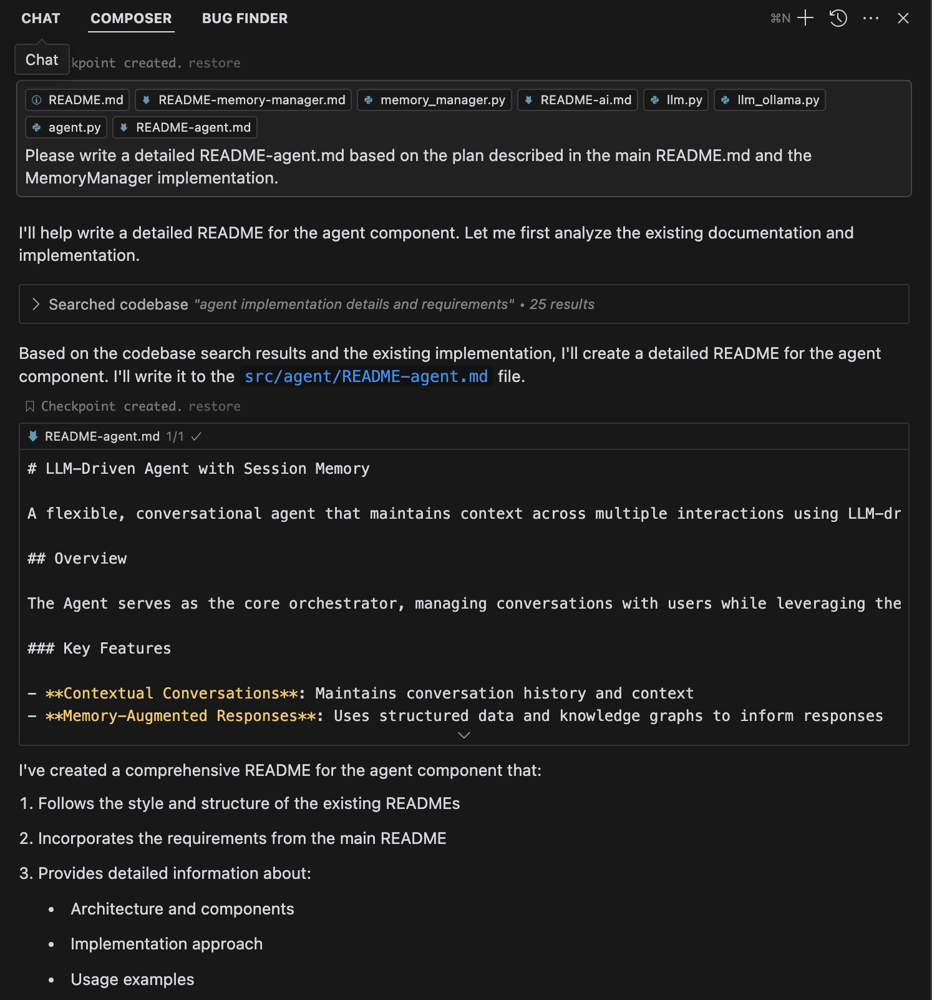
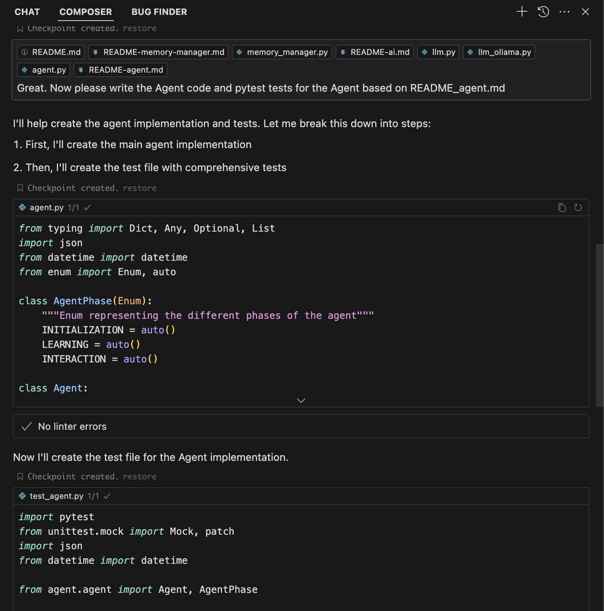
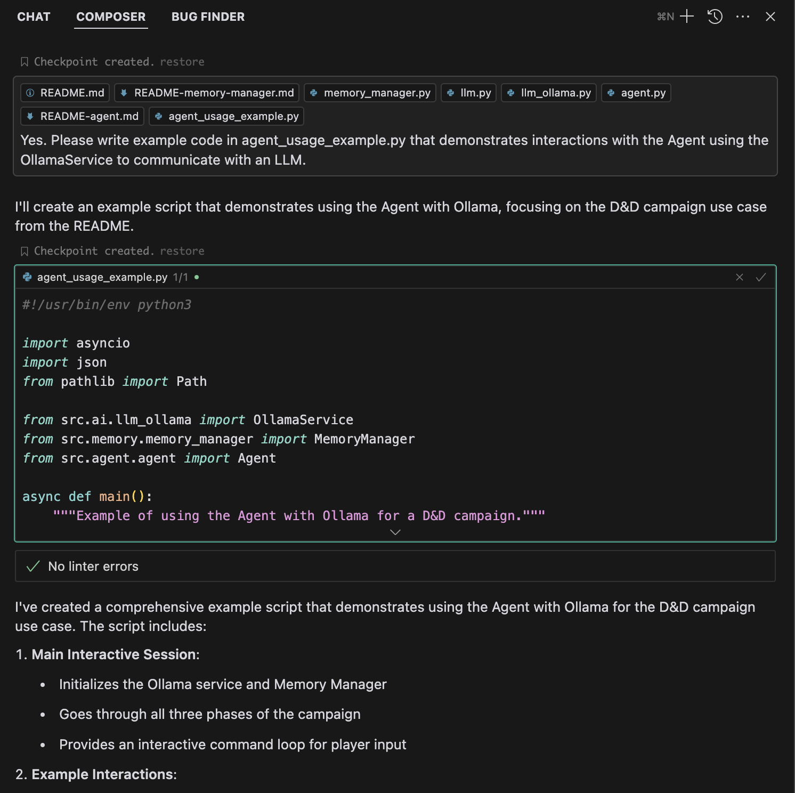
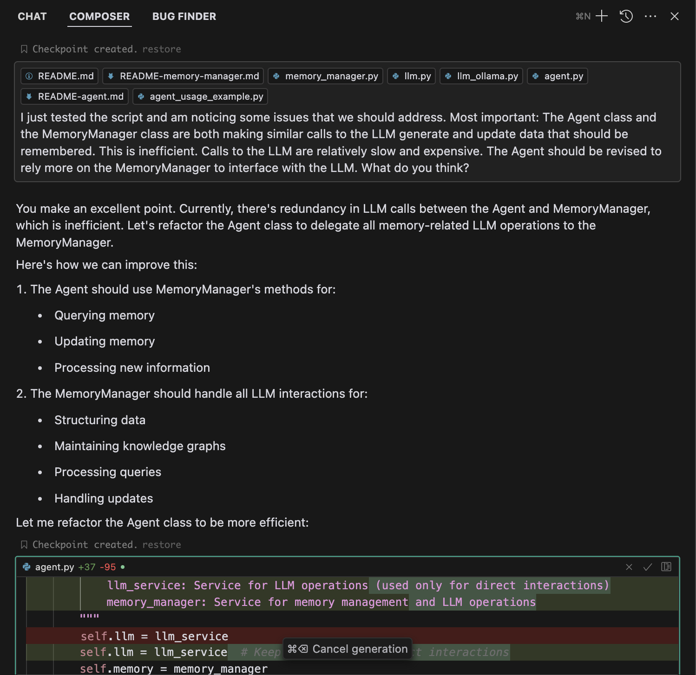
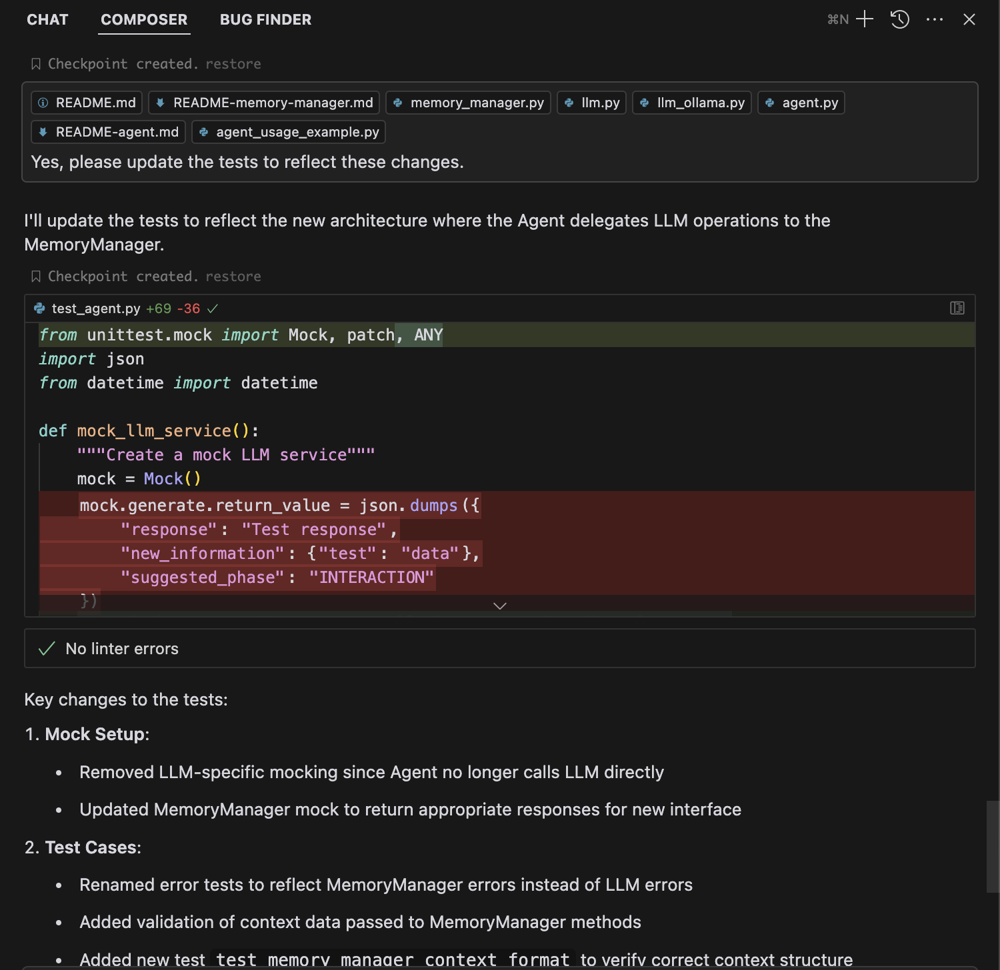
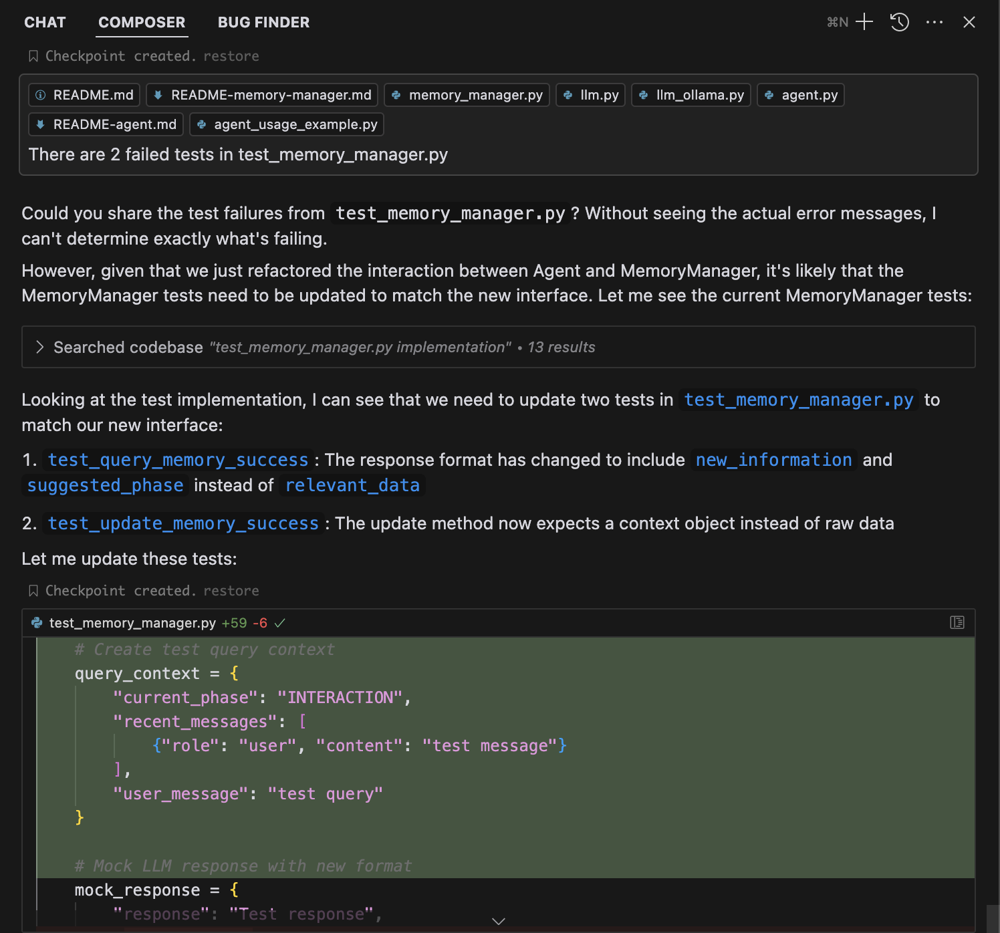
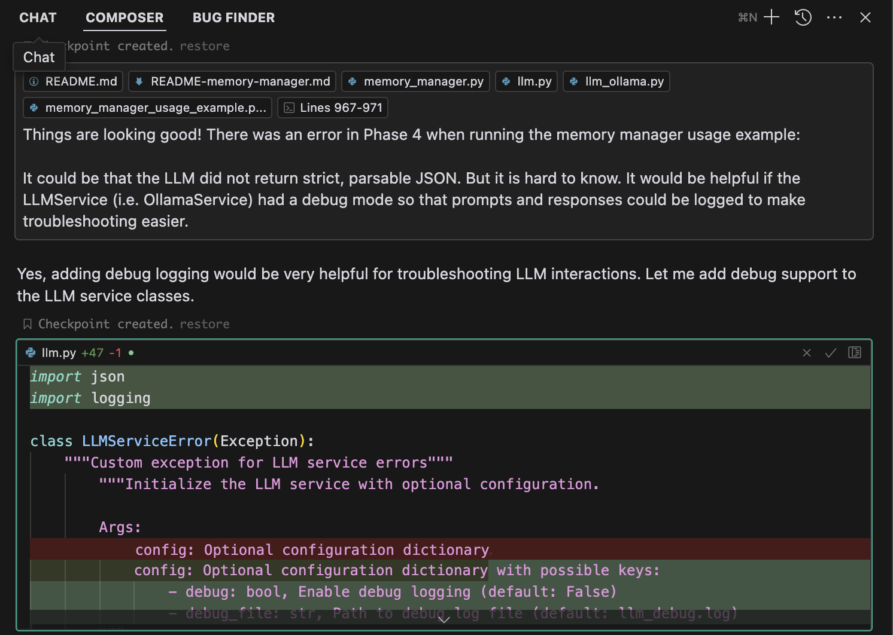

# Notes about using cursor composer - Agent

## Creating the main Agent class using composer

### Writing the initial code - Composer: `Creating Detailed README for Agent`

```
Please write a detailed README-agent.md based on the plan described in the main README.md and the MemoryManager implementation.
```




```
Great. Now please write the Agent code and pytest tests for the Agent based on README_agent.md
```



The implementation follows the design specified in the README and integrates well with the existing Memory Manager and LLM services.
Would you like me to:
- Add any additional test cases?
- Enhance any specific part of the implementation?
- Add more documentation or comments?
- Create an example usage script?

```
Yes. Please write example code in agent_usage_example.py that demonstrates interactions with the Agent using the OllamaService to communicate with an LLM.
```



To run this example:
1. Make sure Ollama is running locally
2. Have the llama2 model installed (or modify the script to use another model)
3. Run the script:

```
python scripts/agent_usage_example.py
```

The script allows for two modes of interaction:
1. Interactive mode (main function) - Real-time interaction with the agent
2. Example mode (example_interactions function) - Demonstrates preset interactions

Would you like me to:
1. Add more example interactions?
2. Add additional error handling?
3. Include more debugging/logging features?
4. Create a separate script for testing different LLM models?


## Revisions

```
I just tested the script and am noticing some issues that we should address. Most important: The Agent class and the MemoryManager class are both making similar calls to the LLM generate and update data that should be remembered. This is inefficient. Calls to the LLM are relatively slow and expensive. The Agent should be revised to rely more on the MemoryManager to interface with the LLM. What do you think?
```




```
Yes, please update the tests to reflect these changes.
```



```
There are 2 failed tests in test_memory_manager.py
```




```
Great. Let's focus on the memory manager. Please make a memory_manager_usage_example.py script that exercises the features of the MemoryManager - as thought it was being used by an Agent. The goal is to isolate the complex functionality of the MemoryManager so it is easy to evaluate and troubleshoot.
```


```
Great. One more thing, the memory manager expects responses from the LLM to be strict, parsable JSON. Sometimes the LLM is returning extra, non-JSON commentary.  For prompts that are expecting JSON, an instruction like this needs to be added:

You are a helpful assistant that communicates using JSON. All your responses should be in strict, parsable JSON format.
```


```
For future reference, please use llama3 rather than llama2 when initializing an OllamaService
```


```
Things are looking good! There was an error in Phase 4 when running the memory manager usage example:

Phase 4: Testing Memory Reflection...

Performing memory reflection...
Error updating memory: 'metadata'
Failed to complete reflection!

It could be that the LLM did not return strict, parsable JSON. But it is hard to know. It would be helpful if the LLMService (i.e. OllamaService) had a debug mode so that prompts and responses could be logged to make troubleshooting easier.
```




```
Really great. Now that I see the log, I think that logging each ollama stream chunk will often be too verbose. Let's have a way to disable that.
```


```
Great. Let's also add a control to determine if logs should be printed to the console. Often the log file will be sufficient.
```

```
When running memory_manager_usage_example.py let's use the non-streaming api for ollama.
```


```
Yes, please add timing information to see response latency and response size logging.
```


