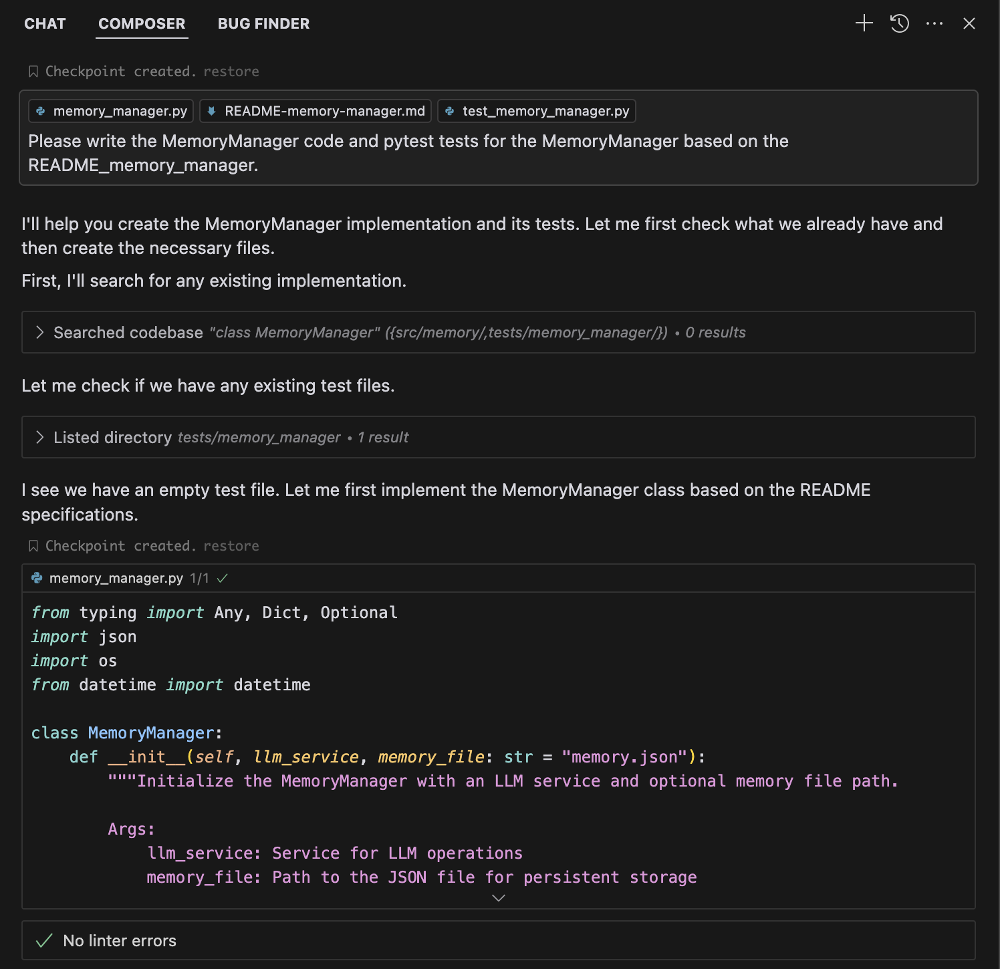
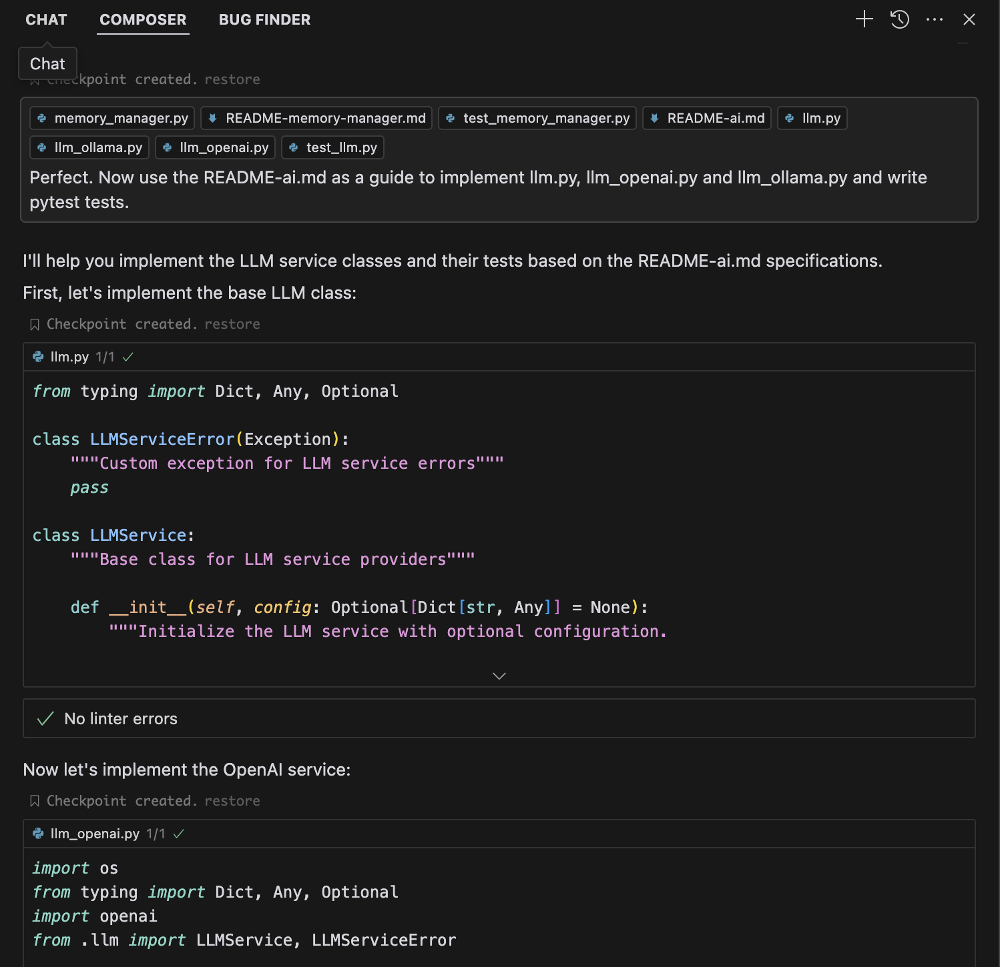
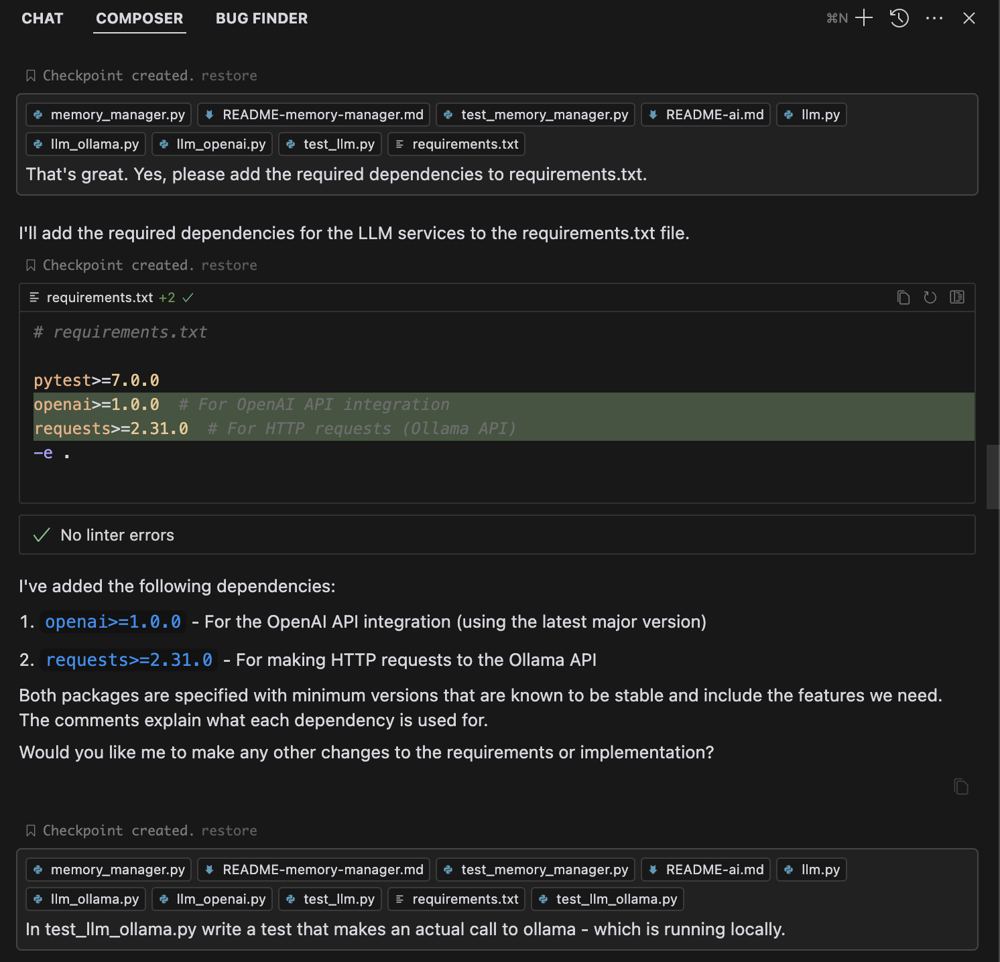
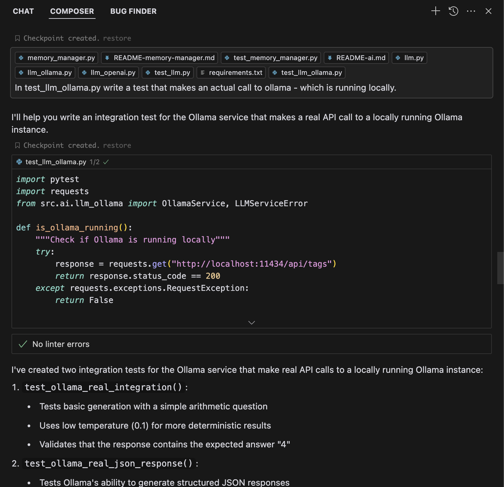
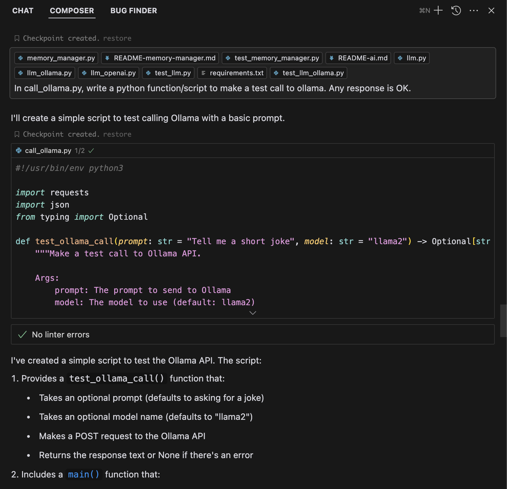
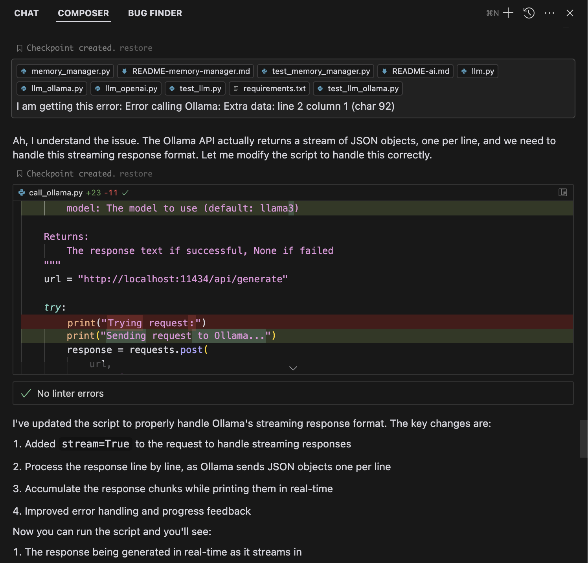
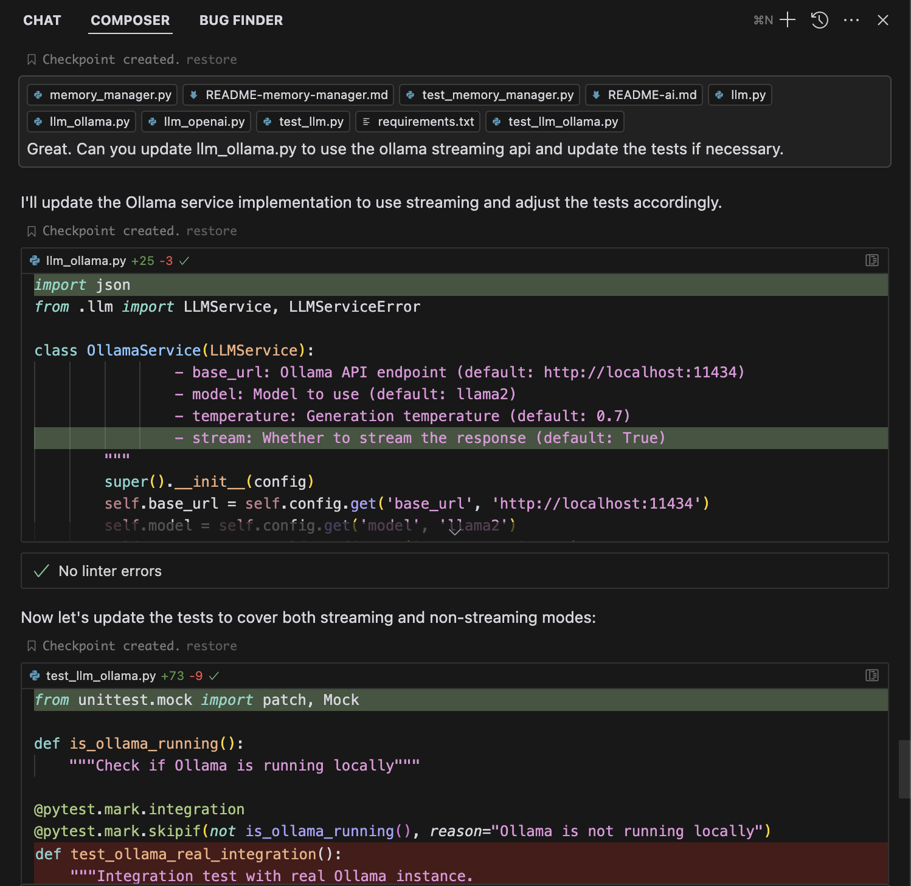
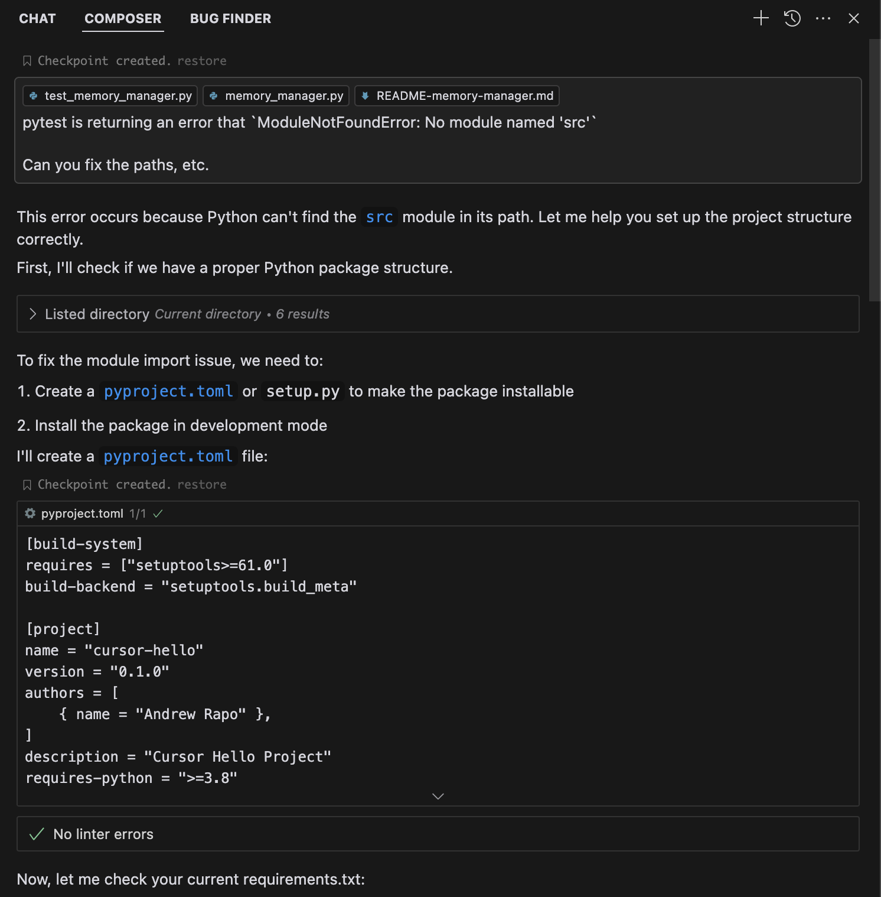
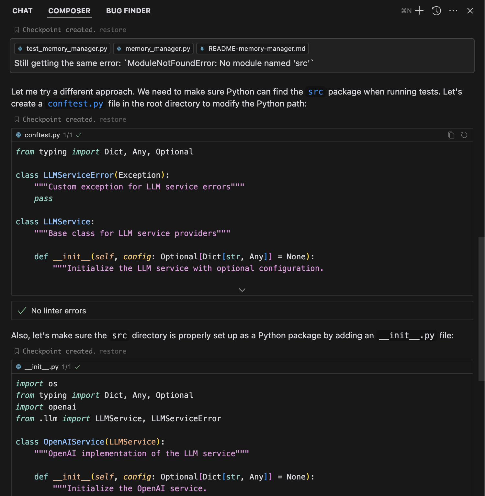

# Notes about using cursor composer - Memory Manager

## Creating the Memory Manager using composer

### Writing the initial code - Composer: `Designing a Memory Manager for Campaign Data`

```
Please write the MemoryManager code and pytest tests for the MemoryManager based on the README_memory_manager.
```



```
Perfect. Now use the README-ai.md as a guide to implement llm.py, llm_openai.py and llm_ollama.py and write pytest tests.
```



```
That's great. Yes, please add the required dependencies to requirements.txt.
```



```
In test_llm_ollama.py write a test that makes an actual call to ollama - which is running locally.
```



```
In call_ollama.py, write a python function/script to make a test call to ollama. Any response is OK.
```




```
I am getting this error: Error calling Ollama: Extra data: line 2 column 1 (char 92)
```



```
Great. Can you update llm_ollama.py to use the ollama streaming api and update the tests if necessary.
```




### Fixing errors - Composer: `Fixing ModuleNotFoundError in pytest`


```
pytest is returning an error that `ModuleNotFoundError: No module named 'src'`

Can you fix the paths, etc.
```



```
Still getting the same error: `ModuleNotFoundError: No module named 'src'`
```




