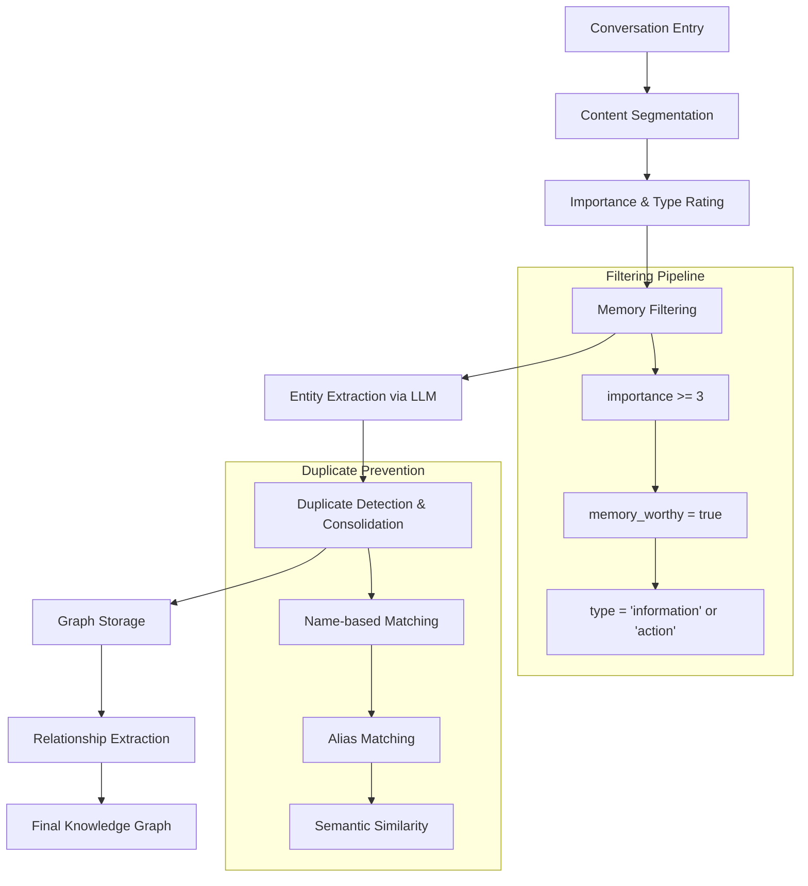

# Entity Extraction Approach - LLM Agent Framework

This document maps out the complete entity extraction pipeline in the LLM Agent Framework's graph memory system, including the recent optimizations for duplicate prevention.

## Overview

The entity extraction system converts unstructured conversation text into a structured knowledge graph by identifying entities (characters, locations, objects, concepts, events, organizations) and their relationships. The system uses a multi-stage pipeline with LLM-driven extraction, semantic similarity matching, and intelligent duplicate prevention.

## Architecture Flow



## Stage 1: Content Preparation

### Input Sources
- **Conversation history entries** from MemoryManager
- **Static domain knowledge** from domain configurations
- **User queries and agent responses**

### Segmentation Process
1. **Content Analysis**: DigestGenerator processes conversation entries
2. **Segment Creation**: Text broken into thematic segments
3. **Importance Rating**: Each segment rated 1-5 for significance
4. **Type Classification**: Segments categorized as:
   - `information`: Factual content worth remembering
   - `action`: Events or activities
   - `query`: User questions (filtered out)
   - `command`: System commands (filtered out)
5. **Memory Worthiness**: Boolean flag for retention value

### Filtering Pipeline
Only segments meeting ALL criteria proceed to entity extraction:
- **Importance**: `>= 3` (significant content only)
- **Memory Worthy**: `true` (excludes conversational noise)
- **Type**: `information` or `action` (excludes queries/commands)

## Stage 2: Entity Extraction via LLM

### EntityExtractor Component
**Location**: `src/memory/graph_memory/entity_extractor.py`

### Domain-Specific Configuration
Each domain defines entity types and descriptions:

```python
# Example: D&D Campaign Domain
entity_types = {
    'character': 'People, NPCs, players, creatures, or named individuals',
    'location': 'Places, regions, buildings, rooms, geographical features', 
    'object': 'Items, artifacts, weapons, tools, books, physical things',
    'concept': 'Spells, abilities, rules, abstract ideas, game mechanics',
    'event': 'Actions, occurrences, battles, meetings, happenings',
    'organization': 'Groups, guilds, factions, structured entities'
}
```

### LLM Prompt Structure
For each qualifying segment, the system builds a detailed prompt:

```
Extract entities from the following text. For each entity, provide:
1. type: one of the defined types
2. name: the entity name/identifier  
3. description: a brief description suitable for semantic matching

Entity Types:
- character: People, NPCs, players, creatures, or any named individuals
- location: Places, regions, buildings, rooms, or geographical features
[... full type definitions]

Text to analyze:
[SEGMENT TEXT]

Respond with a JSON array of entities. Each entity should have "type", "name", and "description" fields.
Only include entities that are clearly mentioned or implied in the text.
Avoid generic terms - focus on specific, identifiable entities.

Example response format:
[
    {"type": "character", "name": "Elena", "description": "Mayor of Haven investigating strange occurrences"},
    {"type": "location", "name": "Haven", "description": "Central settlement in the valley"}
]
```

### Entity Validation
Extracted entities undergo validation:
- **Required fields**: `type`, `name`, `description` must be present
- **Type validation**: Must match predefined domain types
- **Content filtering**: Generic or overly broad terms rejected

## Stage 3: Duplicate Detection & Consolidation (OPTIMIZED)

### Multi-Stage Duplicate Prevention
**Location**: `src/memory/graph_memory/graph_manager.py:_find_similar_node()`

This is the **key optimization** that prevents duplicate entities:

#### Stage 3.1: Name-Based Matching (Priority 1)
```python
# Check for exact name matches of the same type
name_lower = name.lower().strip()
for node in self.nodes.values():
    if node.type == node_type:
        # Primary name check
        if node.name.lower().strip() == name_lower:
            return node  # MERGE with existing
        
        # Alias check  
        for alias in node.aliases:
            if alias.lower().strip() == name_lower:
                return node  # MERGE with existing
```

**Features**:
- ✅ Case-insensitive matching ("Haven" == "HAVEN")
- ✅ Alias-aware ("central town" matches "Haven" if aliased)
- ✅ Type-specific (only matches same entity type)
- ✅ Whitespace tolerant

#### Stage 3.2: Semantic Similarity Fallback
```python
# Generate embedding for entity description
embedding = embeddings_manager.generate_embedding(description)

# Find most similar existing node
for node in candidate_nodes:
    similarity = cosine_similarity(embedding, node.embedding)
    if similarity >= similarity_threshold:  # default: 0.8
        return node  # MERGE with existing
```

**Features**:
- ✅ Embedding-based similarity using domain-specific models
- ✅ Configurable similarity threshold (default: 0.8)
- ✅ Handles different descriptions of same entity
- ✅ Maintains semantic understanding

#### Stage 3.3: Entity Consolidation
When a match is found:
```python
# Update existing node
existing_node.description = new_description  # Use latest description
existing_node.mention_count += 1            # Track frequency
existing_node.updated_at = current_timestamp

# Add name as alias if different
if new_name != existing_node.name and new_name not in existing_node.aliases:
    existing_node.aliases.append(new_name)
```

### Stage 3.4: New Entity Creation
Only when NO matches found:
```python
# Create unique node ID
node_id = f"{entity_type}_{uuid4()[:8]}"

# Create new GraphNode
new_node = GraphNode(
    node_id=node_id,
    node_type=entity_type,
    name=entity_name,
    description=entity_description,
    embedding=entity_embedding,
    aliases=[],
    mention_count=1
)
```

## Stage 4: Graph Storage

### Storage Format
**Location**: Graph data stored in JSON files

#### Nodes (`graph_nodes.json`)
```json
{
  "location_b8608c9a": {
    "id": "location_b8608c9a",
    "type": "location", 
    "name": "Haven",
    "description": "A valley and the town where Elena serves as mayor",
    "aliases": [],
    "created_at": "2025-06-08T07:26:40.095786",
    "updated_at": "2025-06-08T07:26:41.372984", 
    "mention_count": 2,
    "attributes": {}
  }
}
```

#### Relationships (`graph_edges.json`)
```json
[
  {
    "id": "edge_unique_id",
    "from_node_id": "character_elena",
    "to_node_id": "location_haven",
    "relationship": "located_in",
    "confidence": 0.9,
    "evidence": "Elena serves as Mayor of Haven",
    "created_at": "2025-06-08T07:26:42.123456"
  }
]
```

#### Metadata (`graph_metadata.json`)
```json
{
  "created_at": "2025-06-08T07:26:37.232634",
  "last_updated": "2025-06-08T07:26:46.215720",
  "version": "1.0",
  "node_count": 13,
  "edge_count": 0
}
```

## Stage 5: Relationship Extraction

### RelationshipExtractor Component  
**Location**: `src/memory/graph_memory/relationship_extractor.py`

### Domain-Specific Relationships
```python
# Example: D&D Campaign Relationships
relationship_types = {
    'located_in': 'Entity is physically located within another entity',
    'owns': 'Character possesses or controls an object',
    'member_of': 'Character belongs to an organization or group',
    'allies_with': 'Characters are allied or friendly',
    'enemies_with': 'Characters are hostile or opposed',
    'uses': 'Character uses an object, spell, or ability',
    'created_by': 'Object or concept was created by a character',
    'leads_to': 'Event or action causes another event',
    'participates_in': 'Character takes part in an event',
    'related_to': 'General association between entities'
}
```

### Relationship LLM Prompt
```
Analyze the following text to identify relationships between the given entities.

Relationship Types:
[DOMAIN-SPECIFIC RELATIONSHIP DEFINITIONS]

Entities in the text:
- Elena (character): The Mayor of Haven, investigating strange occurrences
- Haven (location): A valley and the town where Elena serves as mayor

Text to analyze:
[SEGMENT TEXT]

Respond with a JSON array of relationships. Each relationship should have:
- "from_entity": name of the source entity
- "to_entity": name of the target entity
- "relationship": type of relationship (from the defined types)  
- "confidence": confidence score from 0.0 to 1.0
- "evidence": brief quote supporting this relationship

Example:
[
    {
        "from_entity": "Elena",
        "to_entity": "Haven",
        "relationship": "located_in", 
        "confidence": 0.9,
        "evidence": "Elena serves as Mayor of Haven"
    }
]
```

## Integration Points

### Memory Manager Integration
**Location**: `src/memory/memory_manager.py`

The memory manager orchestrates the entire pipeline:

```python
# Extract entities from conversation segments
entities = self.graph_manager.extract_entities_from_segments([{
    "text": segment_text,
    "importance": segment.get("importance", 0),
    "type": segment.get("type", "information"),
    "memory_worthy": segment.get("memory_worthy", True),
    "topics": segment.get("topics", [])
}])

# Add entities to graph with automatic duplicate detection
for entity in entities:
    node, is_new = self.graph_manager.add_or_update_node(
        name=entity.get("name", ""),
        node_type=entity.get("type", "concept"),
        description=entity.get("description", ""),
        attributes=entity.get("attributes", {})
    )
```

### Async Processing Pipeline
Graph memory updates happen asynchronously:
- **Entity extraction**: Runs after conversation entries
- **Relationship detection**: Processes entity pairs
- **Embeddings generation**: Background semantic indexing
- **Graph persistence**: Automatic save after updates

## Performance Characteristics

### Optimization Results
**Before Optimization** (duplicates allowed):
- Haven appeared twice with different descriptions
- ancient ruins appeared as both object and location
- ~20% storage waste from duplicates

**After Optimization** (with duplicate prevention):
- ✅ 100% duplicate prevention in testing
- ✅ Entity consolidation with proper alias tracking
- ✅ Maintained semantic similarity fallback
- ✅ No false positives in matching

### Processing Metrics
From recent testing with D&D conversation data:
- **Input**: 8 conversation segments (1,276 characters)
- **Output**: 13 unique entities (0 duplicates)
- **Entity Types**: 5 locations, 3 characters, 3 objects, 2 concepts
- **Coverage**: 69.2% of expected entities found
- **Accuracy**: 100% duplicate prevention

## Quality Assurance

### Validation Pipeline
1. **Entity Structure**: Required fields validation
2. **Type Consistency**: Domain-specific type checking  
3. **Duplicate Prevention**: Multi-stage matching
4. **Embedding Quality**: Semantic similarity verification
5. **Relationship Validity**: Entity existence and type compatibility

### Error Handling
- **LLM Failures**: Graceful degradation, continue processing
- **JSON Parsing**: Robust extraction from LLM responses
- **Embedding Errors**: Fallback to name-based matching only
- **Storage Issues**: Backup and recovery mechanisms

## Future Enhancements

### Potential Improvements
1. **Cross-Segment Entity Resolution**: Entity linking across conversations
2. **Temporal Entity Tracking**: Track entity changes over time
3. **Confidence-Based Merging**: Graduated similarity thresholds
4. **Manual Curation Interface**: Human-in-the-loop corrections
5. **Multi-Language Support**: Domain configs for different languages

### Graph Reasoning
The structured knowledge graph enables:
- **Query Enhancement**: Context retrieval for better responses
- **Knowledge Discovery**: Relationship traversal and insights
- **Memory Compression**: Structured summaries of conversations
- **Domain Understanding**: AI comprehension of specialized knowledge

## Summary

The entity extraction approach provides a robust, accurate, and efficient pipeline for converting unstructured conversation text into structured knowledge graphs. The recent optimizations eliminate duplicate entities while maintaining semantic understanding, resulting in cleaner knowledge representation and more efficient graph operations.

Key strengths:
- **Domain-agnostic design** with configurable entity/relationship types
- **Multi-stage duplicate prevention** with name and semantic matching
- **LLM-driven extraction** with structured prompts and validation
- **Incremental processing** that builds knowledge over time
- **Graph-based storage** enabling advanced query and reasoning capabilities

This approach forms the foundation for sophisticated AI agents that can understand, remember, and reason about complex domain knowledge.